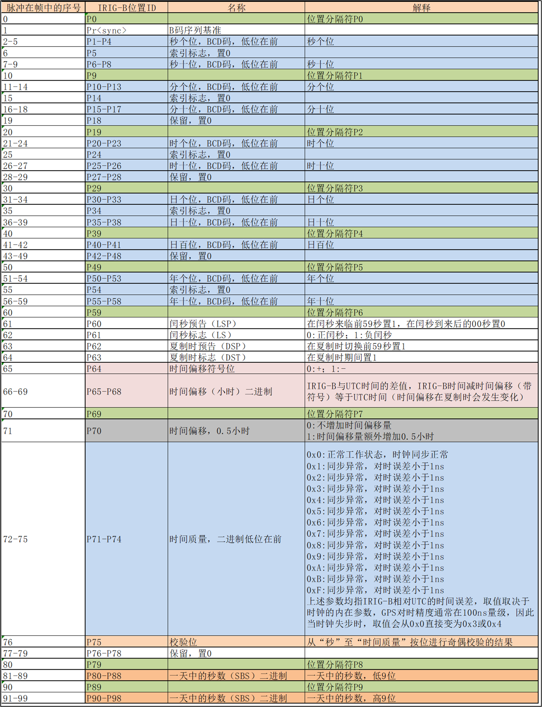

IRIG(Inter Range Instrumentation Group)起源于军队靶场的时间同步，靶场中的时间系统为卫星或航天器发射、常规武器试验、测控系统提供标准时间。IRIG-B时间码(简称B码)就是由IRIG所属的TCG(TelecommunicationGroup)制订的一种串行时间码，被广泛应用于时间信息传输系统中。在实际的应用中，根据距离B码发生器的远近及不同时间精度的要求，B码在实际传输中采用了两种码型AC码(交流码)和DC码(直流码)。当传输距离比较远时采用AC码，当传输距离近时则采用DC码。

在时间服务器、时统设备等时间传输设备中需要非常准确的时间同步，从而保证数据传输的准确性。在数据传输技术的要求高的系统中，如果不采用时钟同步技术，极有可能造成各个级联设备数据时间上的细微误差，进而造成数据传递结果的不准确，将对数据的研究处理产生严重的影响。时间、频率统一设备是为其他设备提供标准、统一时间的，是其他一切时间服务的基础，因此，时统设备是各科学研究领域研究的重要设备之一。尤其在航空航天靶场试验、常规武器试验、网络服务器、政府机构设备、通信、交通、电力等领域中都有广泛的应用:", IRIG-B码是标准的每帧一秒的时间码.具有申行格式，携带丰富的编码信息，传输相对比较简单，也适合实际的使用习惯。国际上通用IR1G-B码格式的时间码，作为时间的同步的标准。

B码信号是每秒一帧的时间串码,一帧串码中包含100个码元，每个码元占用10ms时间，其基本的码元是“0”码元、“1”码元和“P”码元。码元“0”和“1”对应的脉冲宽度为2ms和5ms,“P”码元是位置码元,对应的脉冲宽度为 8 ms

